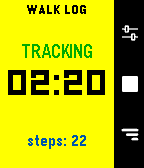
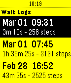
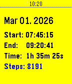
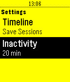
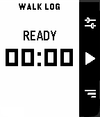
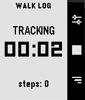
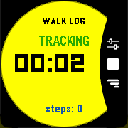
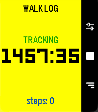

# Walk Log

A simple application to keep track of your walks.

## Description
Walk Log is a Pebble application that tracks the time and steps taken during your walks. Your walk history is stored in the logs view, where you can review past activities and delete entries as needed. You can also send walks to the timeline to view them in the Pebble watch's Past Timeline view.
Set it and for get it: an inactivity option will automatically stop your walk after a set period of inactivity, thanks to a background worker.

## Screenshots
### Pebble Time/Time Steel

### Pebble Original/Steel

### Pebble Pebble 2/Duo

### Pebble Time Round

### Pebble Time 2

## Store

[Rebble App Store](https://apps.rebble.io/en_US/application/69a412a94c5ae70009a92597)

[Pebble App Store](https://apps.repebble.com/69a412a94c5ae70009a92597)

## How to

**Quick Use**
- Open the app
- Press center right button (start symbol)
- Press again to end it (stop symbol)

**Logs**
- Press down right button
- Navigate down from latest to oldest
- Press center right button to open detail
- Long press on center right button to delete, from list or detail page

**Settings**
- Press up right button
- Navigate down to setting you want to change
- Press center right button to change it

## Support
For issues, questions, or suggestions, please open an issue on GitHub.

## License
MIT License - feel free to modify and share!

---
Built with ❤️ for the Pebble community